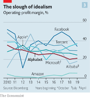
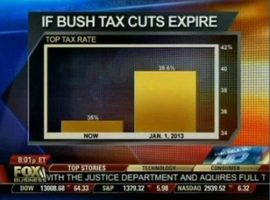

```{r setup, include=FALSE}
knitr::opts_chunk$set(echo = TRUE)
library(tidyverse)
library(gapminder)
```

```{r}
gapminder %>%
  filter(year == 2007) %>%
  select(c(gdpPercap, lifeExp, country)) %>%
  ggplot +
  geom_boxplot(aes(x = gdpPercap, y = lifeExp, group = country)) +
  geom_point(aes(gdpPercap,lifeExp), size = 1) +
  xlab("GDP Per Capita (in US dollars)") +
  ylab("Life Expectancy (in years)") +
  theme_bw()
```

From this data graph, there is clearly a relationship between the `gdpPercap` (GDP Per Capita) of a country and the `lifeExp` (Life Expectancy) of the citizens for that country. Near 0 GDP Per Capita, it appears that the life expectancy has a range from about 40 to somewhere between 65-70. After reaching approximately a $5,000 GDP Per Capita, life expectancy is 70 or above for all but one country and rises somewhat steadily as the GDP Per Capita increases across the graph. The data points on the graph follow an arc shape, rising steeply from the origin and leveling off towards the top right corner of the graph. In general, we can say that as GDP Per Capita increases, so does life expectancy for a country's citizens. 

<br><br><br><br>

First Image corresponds to #4 on homework <br>
Second image corresponds to #6 on homework

```{r, echo=FALSE}

```
<br> I found this image while reading an article about Google concerning its antitrust hearing with House Judiciary Committee of the U.S. Senate. This graph looks confusing at first since the lines do not really have a pattern – and they are not necessarily supposed to. After taking a second to understand what the graph is depicting, it actually tells a very interesting story. The graph shows the percentage profit margin for seven of the biggest tech companies in the world. Alphabet is bolded because it is the parent company of Google, the main topic of this article. If we take a look at their profit margin from 2010 to present, it has actually decreased by about 15%. I found this to be intriguing since tech companies, at least as portrayed in the public eye, seem to be on a meteoric rise. We can see other companies such as Facebook, has had its ups and downs, and is currently heading on a downward slope over the past couple years. Amazon to me is the most interesting company on this chart. Its profit margin is approximately 5%, and that’s the highest it has been in the past 10 years! This is even more interesting when you take into account that Jeff Bezos, CEO of Amazon, is the richest man in the world, and has been increasing his wealth quite quickly as of late. 

The data values that are mapped on this plot are year (incremented along the x-axis by one beginning in 2010 and ending 2019), operating-profit margin (% on the y-axis beginning at 0 and ending at 60), and company (separated by shades of blue except Alphabet in red). This graph shows the operating-profit margin by percentage over the past ten years of seven tech giants (Alibaba, Alphabet, Amazon, Apple, Facebook, Microsoft, and Tencent).  

“Google's Problems Are Bigger than Just the Antitrust Case.” The Economist, The Economist Newspaper, www.economist.com/briefing/2020/07/30/googles-problems-are-bigger-than-just-the-antitrust-case.

<br><br><br>
```{r, echo=FALSE}

```
<br>This graph shows what appears to be a huge disparity if the Bush tax cuts were to expire. Upon closer inspection, the graph has clearly been manipulated to show a story different from what is actually occurring. The graph shows the top tax rate at the current moment, labeled “Now” (presumably some time in 2012), and one for the future labeled “Jan 1, 2013". The bar representing the future tax rates appears to be about five times as large as the bar representing the current tax rate. This is extremely misleading since because the y-axis measuring the top tax rate by percentage begins at 34 and ends at 42, creating a mammoth effect for the future tax rate. While in reality, the tax rate is only increasing by less than five percentage points, nowhere near the almost quintuple increase a quick glance at this graph would lead you to believe. 

To correct this graph, I think it is simple. Start the tax rate percentage at 0 incrementting by something like four or five, and end at 40. This will show a clearer picture of what the actual comparison between these two bars should be. And by not going over 40, there will be a lower data-ink ratio, maximizing the space contained by the bars in the graph. 

“Misleading Graphs: Real Life Examples.” Statistics How To, 29 July 2020, www.statisticshowto.com/misleading-graphs/.
<br>While this image is actually from a Fox News segment, listed above is the source I was able to find it at.
